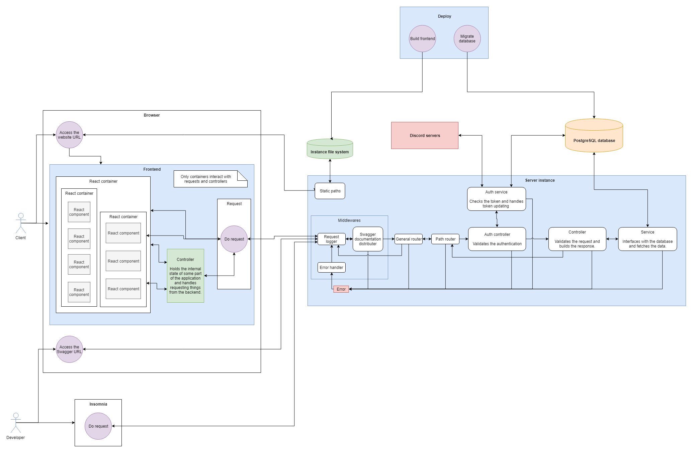

# H A V O C Nexus

A platform for ODY to manage its various operations and member involvement.

- [Trello board](https://trello.com/b/PXYEYzl4)
- [Design Trello board](https://trello.com/b/SmOJFAOT)
- [Google Drive folder](https://drive.google.com/drive/folders/1iQW2i46pwHhgaeSMMbHLN6VWz2U21BPY?usp=sharing)

The rough (and possibly outdated) structure of the service:



## Requirements

- [Node.js](https://nodejs.org/en/) 8 LTS or newer
- [npm](https://www.npmjs.com/) 6.0.0 or newer
- [Docker and Docker Compose](https://docs.docker.com/compose/install/)

If you're using Visual Studio Code, the following extensions are recommended:

- EditorConfig for VS Code (must have!)
- Docker
- ESLint
- npm
- vscode-icons (optional, needs to be activated separately)
- GitLens (optional, disabling some of the features is recommended)

## API documentation

When the Node.js server is running, the Swagger documentation can be viewed at path `/api/api-docs`.

## Installation

In order to install the dependencies, navigate to the project folder and run

```bash
npm install
```
## Run with Docker Compose

### Via build.sh
You must use Powershell as administrator for best results when building the project
* run `./build.sh`
* run "docker compose --file sdi-docker-compose.yml up -d --build" without quotes to start the project in a docker container.
    * For AWS the images built must be pushed to ECR
    * For AWS you need to deploy the docker compose file to EC2

## Gaining permissions in development

If the application tells you that you do not have permissions, you can modify permissions at runtime to test different permission levels.

You can give yourself "member" permissions by using the following script:
```bash
npm run make-member
```

You can give yourself "management" permissions by using the following script:
```bash
npm run make-manager
```

You can give yourself "admin" permissions by using the following script:
```bash
npm run make-admin
```
## Seeding the database

You can fill the application with some dummy data by running

```bash
npm run seed
```